# Diyargezen FRP Karakter Yaratıcısı - Detaylı Şemalar

## 📋 İçindekiler
1. [Detaylı UML Sınıf Diyagramları](#detaylı-uml-sınıf-diyagramları)
2. [Sequence Diyagramları](#sequence-diyagramları)
3. [Veritabanı Şeması](#veritabanı-şeması)
4. [API/Interface Şeması](#apiinterface-şeması)
5. [State Diyagramları](#state-diyagramları)
6. [Component Diyagramları](#component-diyagramları)

---

## 🏛️ Detaylı UML Sınıf Diyagramları

### Ana Sınıf Yapısı

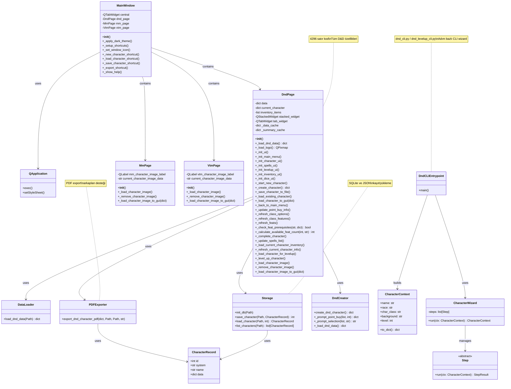

### GUI Bileşenleri Detayı

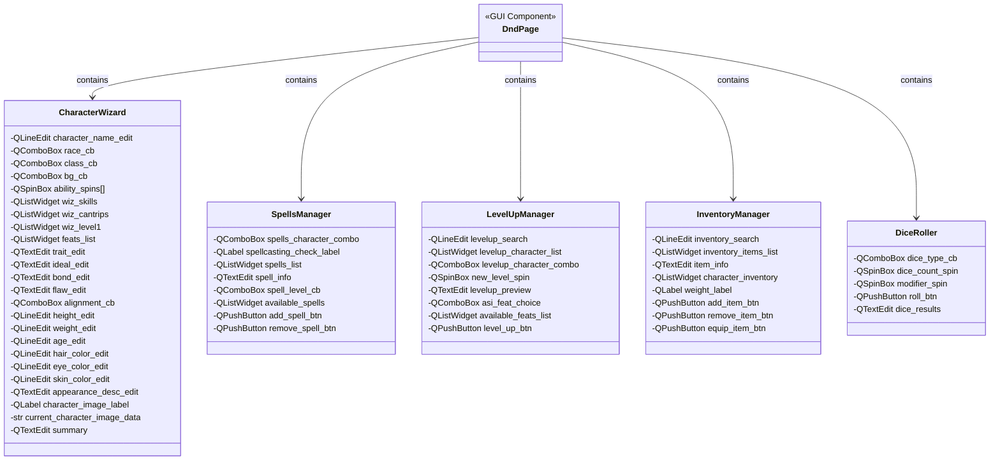

---

## 🔄 Sequence Diyagramları

### Karakter Oluşturma Akışı

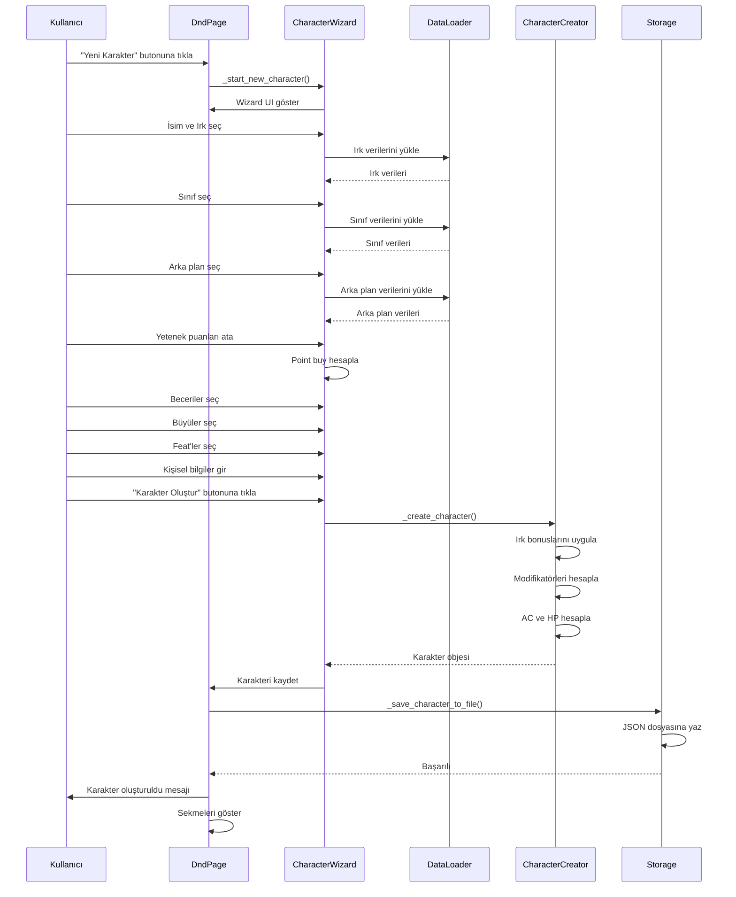

### Karakter Yükleme Akışı

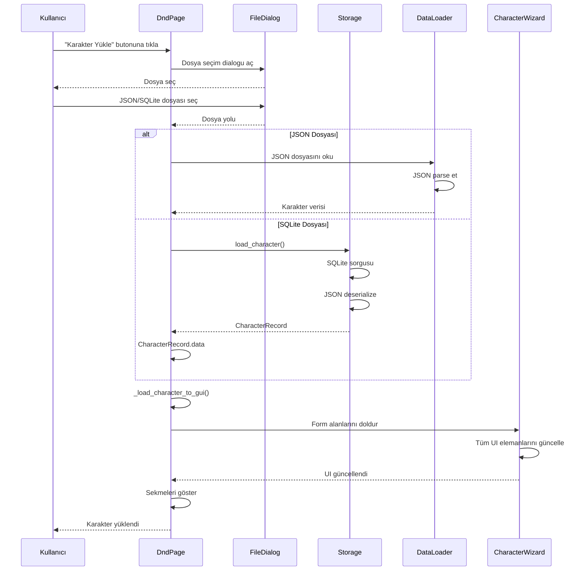

### PDF Export Akışı

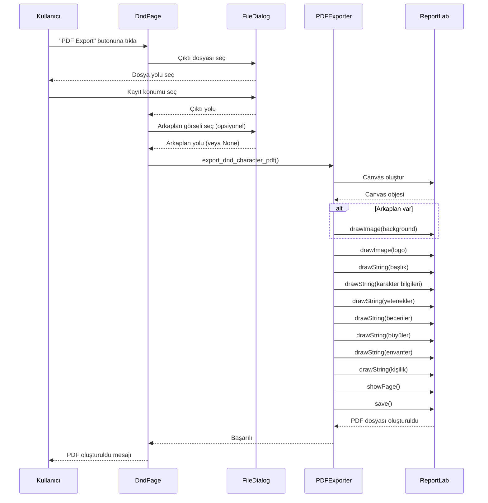

### Level Up Akışı

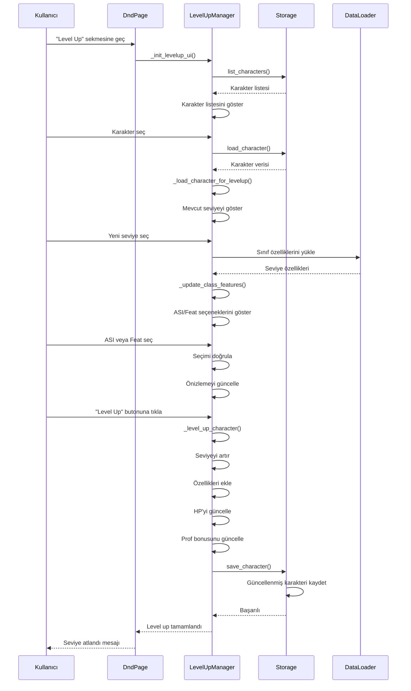

---

## 🗄️ Veritabanı Şeması

### SQLite Veritabanı Yapısı

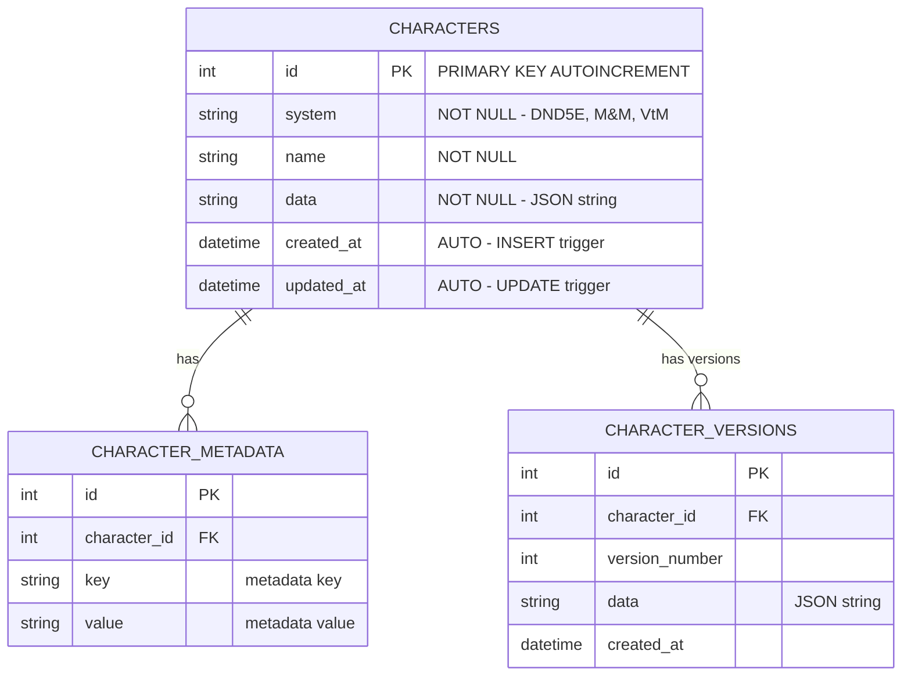

### JSON Veri Yapısı (characters/)

```mermaid
graph TB
    A[Karakter JSON Dosyası] --> B[system: DND5E]
    A --> C[name: string]
    A --> D[race: string]
    A --> E[class: string]
    A --> F[level: int]
    A --> G[abilities: dict]
    A --> H[ability_modifiers: dict]
    A --> I[skills: dict]
    A --> J[spells: dict]
    A --> K[feats: list]
    A --> L[equipment: list]
    A --> M[inventory: list]
    A --> N[personality: dict]
    A --> O[physical: dict]
    A --> P[appearance: dict]
    A --> P1[image: string (base64)]
    A --> Q[background: string]
    A --> R[background_features: dict]
    A --> S[class_features: dict]
    A --> T[equipment_effects: dict]
    
    G --> G1[Strength: int]
    G --> G2[Dexterity: int]
    G --> G3[Constitution: int]
    G --> G4[Intelligence: int]
    G --> G5[Wisdom: int]
    G --> G6[Charisma: int]
    
    I --> I1[class_skills: list]
    I --> I2[proficiencies: dict]
    
    J --> J1[cantrips: list]
    J --> J2[1st_level: list]
    J --> J3[spell_slots: dict]
    
    M --> M1[name: string]
    M --> M2[category: string]
    M --> M3[weight: float]
    M --> M4[quantity: int]
    M --> M5[equipped: bool]
    M --> M6[data: dict]
    
    N --> N1[trait: string]
    N --> N2[ideal: string]
    N --> N3[bond: string]
    N --> N4[flaw: string]
    N --> N5[alignment: string]
    
    O --> O1[height: string]
    O --> O2[weight: string]
    O --> O3[age: string]
    
    P --> P1[hair_color: string]
    P --> P2[eye_color: string]
    P --> P3[skin_color: string]
    P --> P4[description: string]
```

### Veri İlişkileri

```mermaid
erDiagram
    DND_DATA {
        string races "23 ırk"
        string classes "14 sınıf"
        string backgrounds "arka planlar"
        string feats "42 feat"
        string spells "büyüler"
        string items "1000+ eşya"
    }
    
    CHARACTER {
        string race "FK -> races"
        string class "FK -> classes"
        string background "FK -> backgrounds"
        list feats "FK -> feats"
        list spells "FK -> spells"
        list inventory "FK -> items"
    }
    
    RACE {
        string name PK
        dict ability_score_increase
        list traits
        int speed
    }
    
    CLASS {
        string name PK
        string hit_die
        list primary_ability
        list saving_throws
        list class_skills
        dict class_features
    }
    
    FEAT {
        string name PK
        dict prerequisites
        string description
    }
    
    SPELL {
        string name PK
        string level
        string school
        string description
    }
    
    ITEM {
        string name PK
        string category
        float weight
        string cost
        dict properties
    }
    
    DND_DATA ||--o{ RACE : contains
    DND_DATA ||--o{ CLASS : contains
    DND_DATA ||--o{ FEAT : contains
    DND_DATA ||--o{ SPELL : contains
    DND_DATA ||--o{ ITEM : contains
    
    CHARACTER }o--|| RACE : uses
    CHARACTER }o--|| CLASS : uses
    CHARACTER }o--o{ FEAT : has
    CHARACTER }o--o{ SPELL : knows
    CHARACTER }o--o{ ITEM : owns
```

---

## 🔌 API/Interface Şeması

### Modül Arayüzleri

```mermaid
graph TB
    subgraph "Public API"
        A[data_loader.py] --> A1[load_dnd_data: Path -> dict]
        B[storage.py] --> B1[init_db: Path -> None]
        B --> B2[save_character: Path, CharacterRecord -> int]
        B --> B3[load_character: Path, int -> CharacterRecord]
        B --> B4[list_characters: Path -> list[CharacterRecord]]
        C[export_pdf.py] --> C1[export_dnd_character_pdf: dict, Path, Path, str -> None]
    end
    
    subgraph "Internal API"
        D[DndPage] --> D1[_load_dnd_data: -> dict]
        D --> D2[_create_character: -> dict]
        D --> D3[_save_character_to_file: -> None]
        D --> D4[_load_existing_character: -> None]
        D --> D5[_load_character_to_gui: dict -> None]
    end
    
    subgraph "Data Structures"
        E[CharacterRecord] --> E1[id: int]
        E --> E2[system: str]
        E --> E3[name: str]
        E --> E4[data: dict]
    end
```

### Fonksiyon İmzaları

```python
# utils/data_loader.py
def load_dnd_data(base_dir: Path) -> Dict[str, Any]:
    """
    D&D verisini yükler ve background dosyalarını birleştirir.
    
    Args:
        base_dir: Proje ana dizini
        
    Returns:
        Tüm D&D verilerini içeren dict
    """

# utils/storage.py
def init_db(db_path: Path) -> None:
    """SQLite veritabanını başlatır."""

def save_character(db_path: Path, record: CharacterRecord) -> int:
    """
    Karakteri SQLite'a kaydeder.
    
    Returns:
        Kaydedilen karakterin ID'si
    """

def load_character(db_path: Path, record_id: int) -> Optional[CharacterRecord]:
    """ID ile karakteri yükler."""

def list_characters(db_path: Path) -> list[CharacterRecord]:
    """Tüm karakterleri listeler."""

# utils/export_pdf.py
def export_dnd_character_pdf(
    character: dict,
    output_path: Path,
    background_path: Optional[Path] = None,
    page_size: str = "A4"
) -> None:
    """
    D&D karakterini PDF'e export eder.
    
    Args:
        character: Karakter verisi
        output_path: PDF çıktı yolu
        background_path: Opsiyonel arkaplan görseli
        page_size: A4 veya Letter
    """

# gui/app.py - DndPage
class DndPage(QWidget):
    def _load_dnd_data(self) -> dict:
        """D&D verisini cache ile yükler."""
    
    def _create_character(self) -> dict:
        """GUI'den karakter oluşturur."""
    
    def _save_character_to_file(self) -> None:
        """Karakteri JSON dosyasına kaydeder."""
    
    def _load_existing_character(self) -> None:
        """JSON/SQLite'dan karakter yükler."""
    
    def _load_character_to_gui(self, character: dict) -> None:
        """Karakter verisini GUI'ye yükler."""
```

### Veri Kontratları

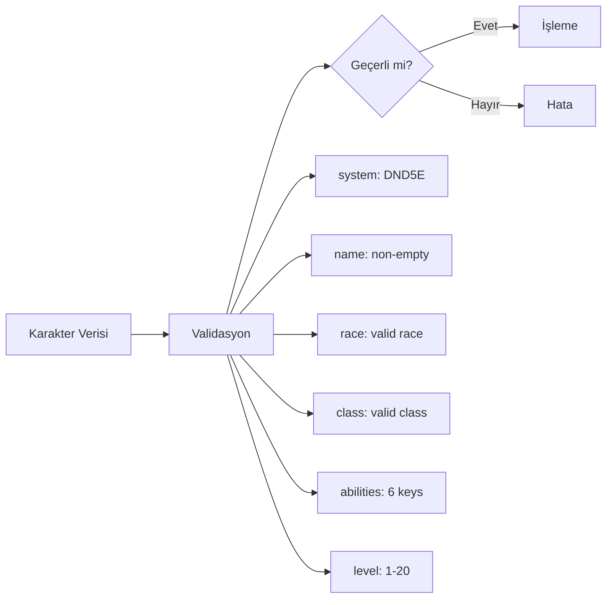

---

## 🔀 State Diyagramları

### Karakter Oluşturma State Machine

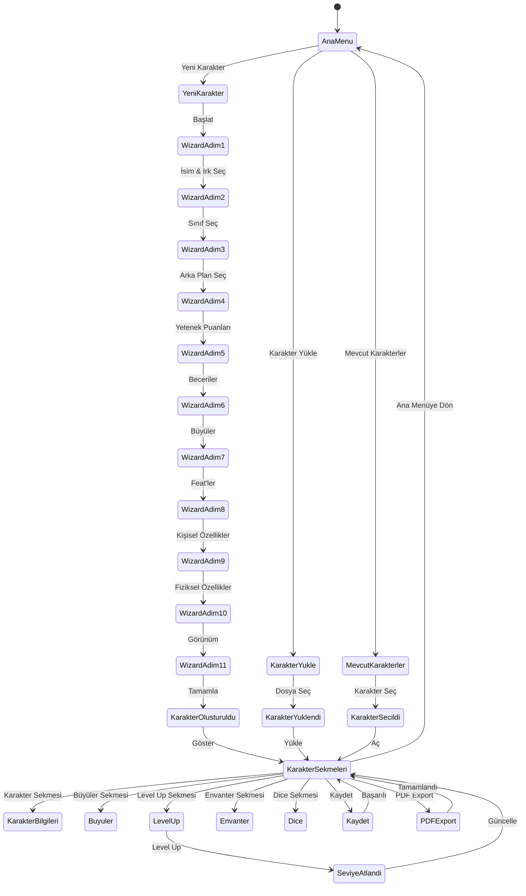

### Karakter Verisi State Machine

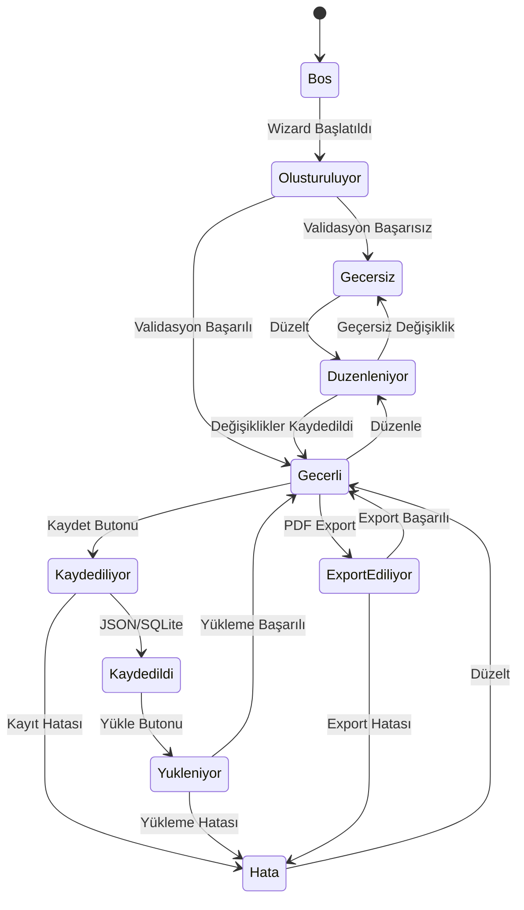

---

## 🧩 Component Diyagramları

### Sistem Bileşenleri

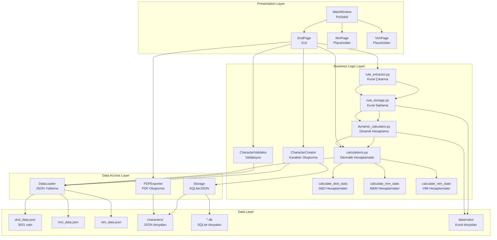

### Modül Bağımlılıkları

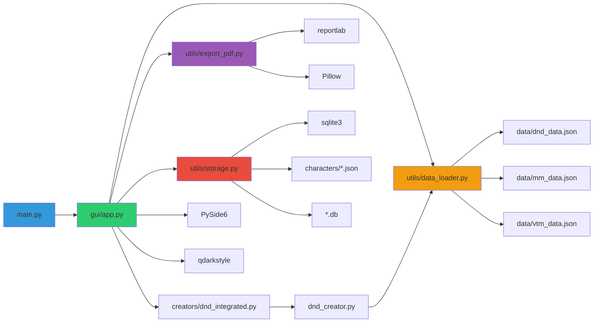

---

## 📊 Veri Akış Detayları

### Karakter Verisi İşleme Pipeline

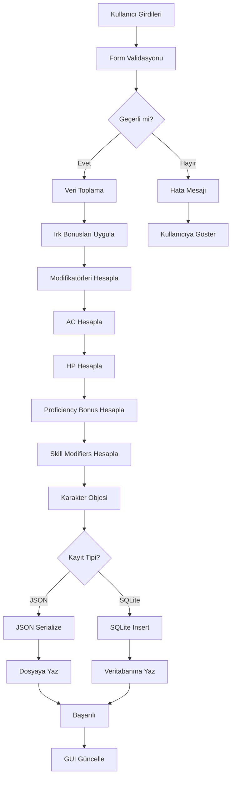

### Cache Mekanizması

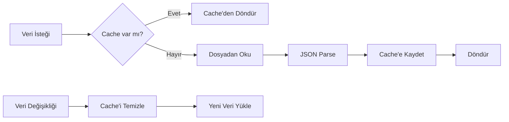

---

## 🔐 Güvenlik ve Validasyon

### Input Validasyon Şeması

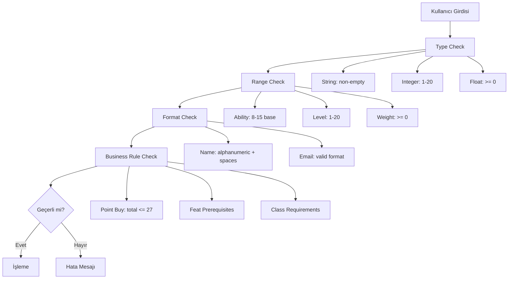

---

**Oluşturulma Tarihi**: 2024  
**Versiyon**: 2.0 - Detaylı Şemalar  
**Geliştirici**: Deniz Şahin (2221032838)


