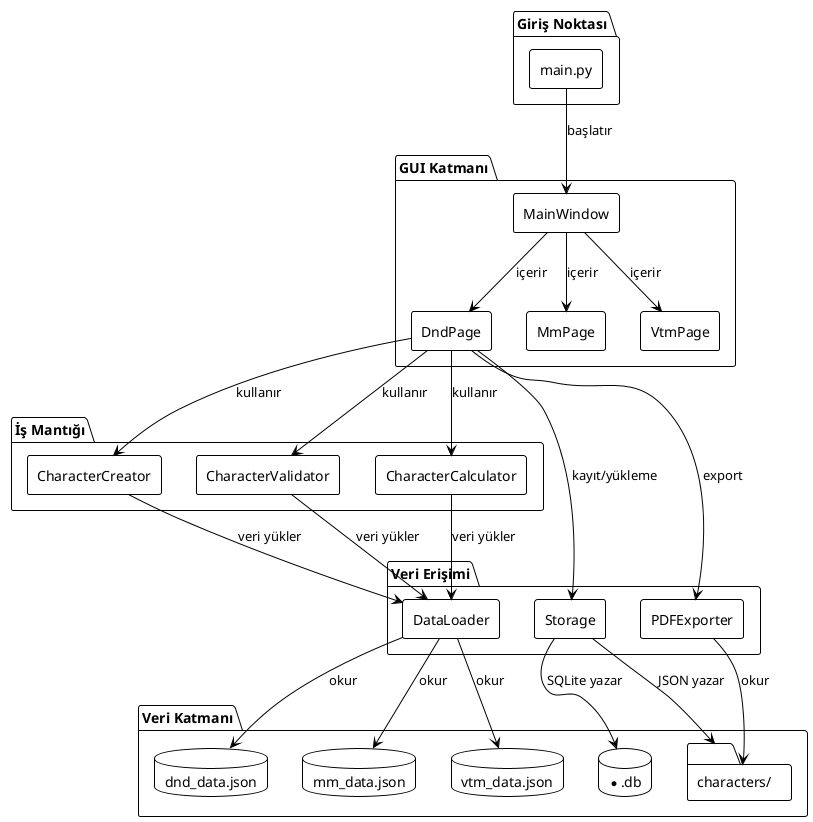
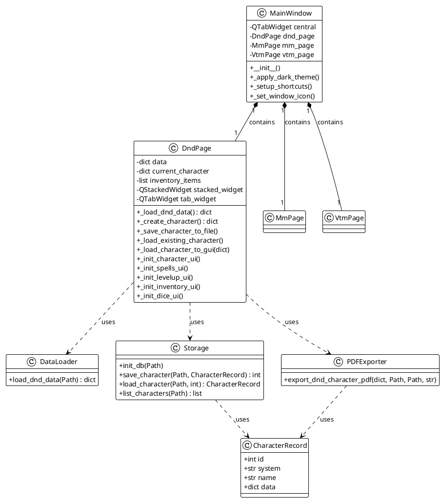
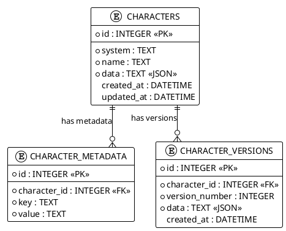
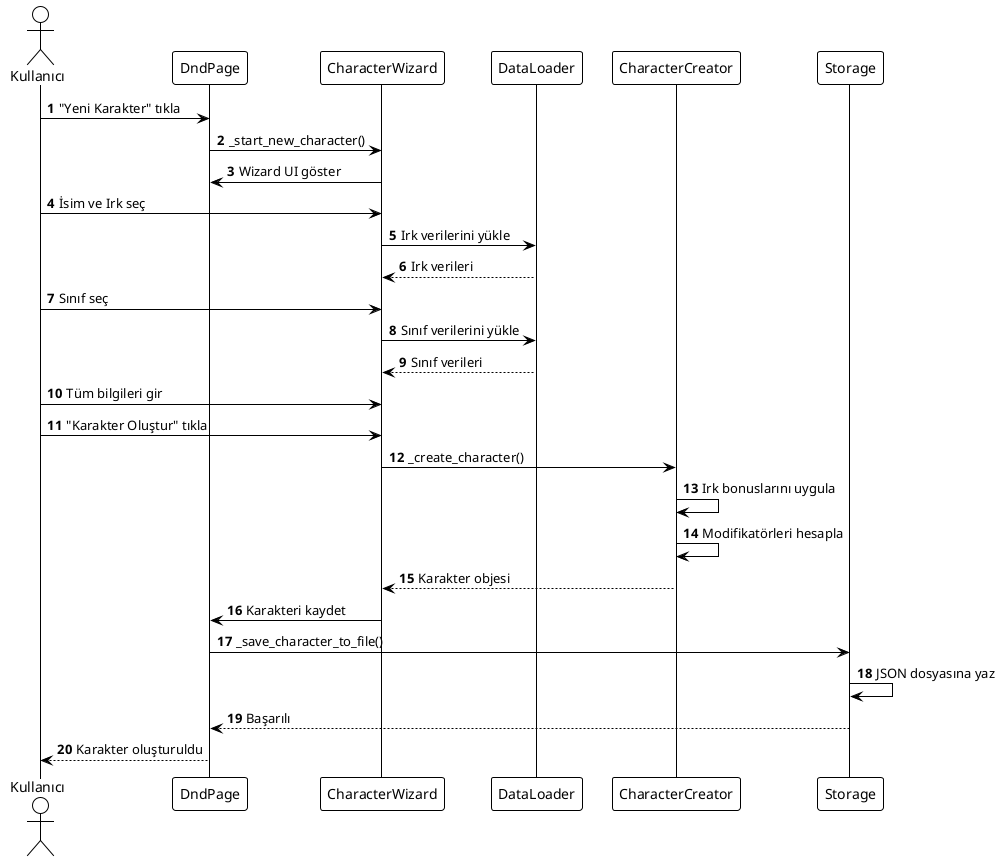

# Diyargezen FRP Karakter Yaratıcısı - Görsel Şemalar

## 📋 İçindekiler
1. [PlantUML Şemaları](#plantuml-şemaları)
2. [Görsel Mimari Diyagramları](#görsel-mimari-diyagramları)
3. [Kullanım Kılavuzu](#kullanım-kılavuzu)

---

## 🎨 PlantUML Şemaları

### Sistem Mimarisi (PlantUML)



### Detaylı Sınıf Diyagramı (PlantUML)



### Veritabanı ER Diyagramı (PlantUML)



### Sequence Diyagramı (PlantUML)



---

## 🏗️ Görsel Mimari Diyagramları

### Katmanlı Mimari

```
┌─────────────────────────────────────────────────────────┐
│                  PRESENTATION LAYER                    │
│  ┌──────────┐  ┌──────────┐  ┌──────────┐           │
│  │MainWindow│  │ DndPage   │  │ MmPage   │           │
│  │ (PySide6)│  │ (4296 satır)│ │ (Placeholder)│        │
│  └────┬─────┘  └────┬──────┘  └──────────┘           │
│       │             │                                  │
└───────┼─────────────┼──────────────────────────────────┘
        │             │
        ▼             ▼
┌─────────────────────────────────────────────────────────┐
│                  BUSINESS LOGIC LAYER                    │
│  ┌──────────────┐  ┌──────────────┐                  │
│  │Character     │  │Character      │                  │
│  │Creator       │  │Validator      │                  │
│  └──────┬───────┘  └──────┬───────┘                  │
│         │                 │                           │
│  ┌──────▼─────────────────▼───────┐                  │
│  │  CharacterCalculator            │                  │
│  │  - AC Hesaplama                  │                  │
│  │  - HP Hesaplama                  │                  │
│  │  - Modifikatör Hesaplama         │                  │
│  └──────────────────────────────────┘                  │
└─────────────────────────────────────────────────────────┘
        │
        ▼
┌─────────────────────────────────────────────────────────┐
│                  DATA ACCESS LAYER                       │
│  ┌──────────┐  ┌──────────┐  ┌──────────┐           │
│  │DataLoader│  │ Storage   │  │PDFExporter│           │
│  │ (JSON)   │  │(SQLite/   │  │(ReportLab)│           │
│  │          │  │ JSON)     │  │           │           │
│  └────┬─────┘  └────┬──────┘  └────┬──────┘           │
└───────┼─────────────┼───────────────┼───────────────────┘
        │             │               │
        ▼             ▼               ▼
┌─────────────────────────────────────────────────────────┐
│                    DATA LAYER                          │
│  ┌──────────────┐  ┌──────────────┐  ┌─────────────┐│
│  │dnd_data.json │  │characters/    │  │*.db          ││
│  │(3631 satır)  │  │*.json         │  │(SQLite)      ││
│  └──────────────┘  └──────────────┘  └─────────────┘│
└─────────────────────────────────────────────────────────┘
```

### Veri Akış Diyagramı (ASCII)

```
                    ┌─────────────┐
                    │  Kullanıcı  │
                    └──────┬──────┘
                           │
                           ▼
        ┌──────────────────────────────────────┐
        │         GUI Formları                │
        │  - İsim, Irk, Sınıf                │
        │  - Yetenek Puanları                 │
        │  - Beceriler, Büyüler               │
        └──────────────┬─────────────────────┘
                       │
                       ▼
        ┌──────────────────────────────────────┐
        │     Karakter Validasyonu             │
        │  - Type Check                        │
        │  - Range Check                       │
        │  - Business Rules                    │
        └──────────────┬─────────────────────┘
                       │
                       ▼
        ┌──────────────────────────────────────┐
        │     Karakter Objesi Oluşturma        │
        │  - Irk Bonusları Uygula             │
        │  - Modifikatörleri Hesapla           │
        │  - AC, HP Hesapla                    │
        └──────────────┬─────────────────────┘
                       │
                       ▼
        ┌──────────────────────────────────────┐
        │         Kayıt Seçimi                 │
        └──────┬──────────────────┬──────────┘
               │                  │
               ▼                  ▼
    ┌─────────────────┐  ┌─────────────────┐
    │  JSON Export    │  │ SQLite Export    │
    │  characters/    │  │ *.db            │
    └─────────────────┘  └─────────────────┘
               │                  │
               └────────┬─────────┘
                        │
                        ▼
            ┌───────────────────────┐
            │   PDF Export          │
            │   (Opsiyonel)         │
            └───────────────────────┘
```

### Modül Bağımlılık Ağacı

```
main.py
│
├── gui/app.py (4296 satır)
│   │
│   ├── utils/data_loader.py
│   │   └── data/dnd_data.json
│   │   └── data/mm_data.json
│   │   └── data/vtm_data.json
│   │
│   ├── utils/storage.py
│   │   ├── characters/*.json
│   │   └── *.db (SQLite)
│   │
│   ├── utils/export_pdf.py
│   │   ├── reportlab
│   │   └── Pillow
│   │
│   └── creators/dnd_integrated.py
│       └── dnd_creator.py
│
├── PySide6 (GUI Framework)
├── qdarkstyle (Theme)
└── External Dependencies
    ├── reportlab (PDF)
    ├── Pillow (Images)
    └── sqlite3 (Database)
```

---

## 📐 Kullanım Kılavuzu

### PlantUML Kullanımı

1. **PlantUML Kurulumu**:
```bash
# Java gereklidir
# PlantUML JAR dosyasını indirin
wget http://sourceforge.net/projects/plantuml/files/plantuml.jar/download -O plantuml.jar
```

2. **Diyagram Oluşturma**:
```bash
# PlantUML dosyasını PNG'ye çevir
java -jar plantuml.jar -tpng DETAYLI_SEMALAR.md

# SVG formatında
java -jar plantuml.jar -tsvg DETAYLI_SEMALAR.md
```

3. **Online Kullanım**:
   - http://www.plantuml.com/plantuml/ adresine gidin
   - PlantUML kodunu yapıştırın
   - PNG/SVG olarak indirin

### Mermaid Kullanımı

1. **Online Editor**:
   - https://mermaid.live/ adresine gidin
   - Mermaid kodunu yapıştırın
   - PNG/SVG olarak export edin

2. **VS Code Extension**:
   - "Markdown Preview Mermaid Support" extension'ını yükleyin
   - Markdown dosyalarında otomatik render

3. **GitHub/GitLab**:
   - Markdown dosyalarında otomatik render edilir
   - Pull request'lerde görsel olarak gösterilir

### Görsel Şema Oluşturma Scripti

Aşağıdaki Python scriptini kullanarak görsel şemalar oluşturabilirsiniz:

```python
# generate_diagrams.py
# Bu script Mermaid diyagramlarını görselleştirmek için kullanılabilir
# Ancak doğrudan Python ile Mermaid render etmek için
# mermaid.ink API veya benzeri servisler kullanılmalıdır
```

---

## 🎯 Şema Türleri ve Kullanım Alanları

| Şema Türü | Format | Kullanım Alanı | Araç |
|-----------|--------|----------------|------|
| Sistem Mimarisi | Mermaid/PlantUML | Genel sistem yapısı | Mermaid Live, PlantUML |
| Sınıf Diyagramı | UML/PlantUML | Kod yapısı | PlantUML, draw.io |
| Sequence Diyagramı | Mermaid/PlantUML | İşlem akışları | Mermaid Live, PlantUML |
| ER Diyagramı | PlantUML | Veritabanı yapısı | PlantUML, dbdiagram.io |
| State Diyagramı | Mermaid | Durum geçişleri | Mermaid Live |
| Component Diyagramı | Mermaid/PlantUML | Bileşen ilişkileri | Mermaid Live, PlantUML |

---

## 📝 Notlar

1. **PlantUML**: Java tabanlı, çok güçlü UML diyagram aracı
2. **Mermaid**: JavaScript tabanlı, markdown içinde kullanılabilir
3. **Görsel Şemalar**: ASCII art veya görsel araçlarla oluşturulabilir
4. **Export**: Tüm şemalar PNG, SVG veya PDF formatında export edilebilir

---

**Oluşturulma Tarihi**: 2024  
**Versiyon**: 1.0 - Görsel Şemalar  
**Geliştirici**: Deniz Şahin (2221032838)


