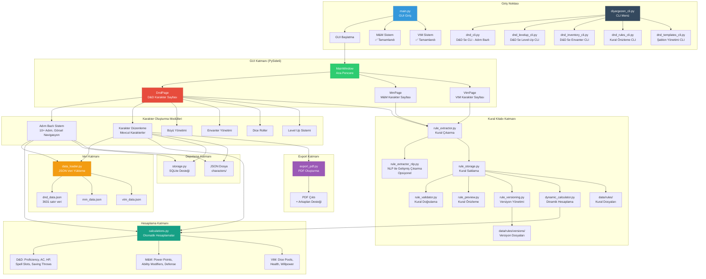
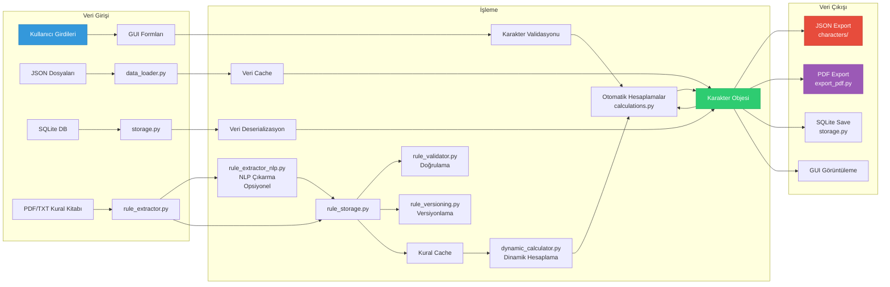
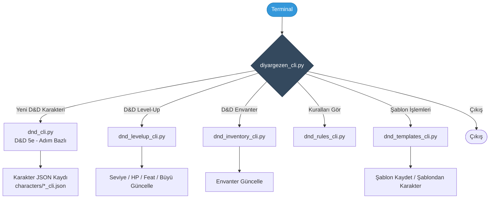
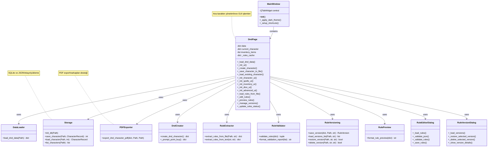

# Diyargezen FRP Karakter Yaratıcısı - Proje Şeması

## 📋 İçindekiler
1. [Sistem Mimarisi](#sistem-mimarisi)
2. [Veri Akış Diyagramı](#veri-akış-diyagramı)
3. [Kullanıcı Akış Diyagramı](#kullanıcı-akış-diyagramı)
4. [Bileşen İlişkileri](#bileşen-ilişkileri)
5. [Dosya Yapısı](#dosya-yapısı)
6. [Teknoloji Stack](#teknoloji-stack)
7. [Özellik Durumu](#özellik-durumu)
8. [Geliştirme Aşamaları](#geliştirme-aşamaları)

---

## 🏗️ Sistem Mimarisi



---

## 🔄 Veri Akış Diyagramı



---

## 👤 Kullanıcı Akış Diyagramı

```mermaid
flowchart TD
    Start([Program Başlatma]) --> Menu{Ana Menü<br/>main.py}
    
    Menu -->|Seçim 1| DND[D&D 5e Sistemi]
    Menu -->|Seçim 2| MM[M&M Sistemi<br/>Yakında]
    Menu -->|Seçim 3| VTM[VtM Sistemi<br/>Yakında]
    Menu -->|Seçim 4| Exit([Çıkış])
    
    DND --> GUI[GUI Açılır<br/>MainWindow]
    
    GUI --> MainMenu{Ana Menü<br/>DndPage}
    
    MainMenu -->|Yeni Karakter| AdimBazli[Adım Bazlı Oluşturma<br/>10 Adım]
    MainMenu -->|Karakter Yükle| Load[JSON/SQLite<br/>Yükleme]
    MainMenu -->|Mevcut Karakterler| List[Karakter Listesi]
    
    AdimBazli --> Step1[1. İsim & Irk]
    Step1 --> Step2[2. Sınıf]
    Step2 --> Step3[3. Arka Plan]
    Step3 --> Step4[4. Yetenek Puanları]
    Step4 --> Step5[5. Beceriler]
    Step5 --> Step6[6. Büyüler]
    Step6 --> Step7[7. Feat'ler]
    Step7 --> Step8[8. Kişisel Özellikler]
    Step8 --> Step9[9. Fiziksel Özellikler]
    Step9 --> Step10[10. Görünüm]
    Step10 --> Step11[11. Karakter Resmi<br/>(Opsiyonel)]
    Step11 --> Created[Karakter Oluşturuldu]
    
    Created --> Tabs[Karakter Sekmeleri]
    Load --> Tabs
    List --> Tabs
    
    Tabs --> Tab1[🎭 Karakter<br/>Bilgileri]
    Tabs --> Tab2[🔮 Büyüler]
    Tabs --> Tab3[📈 Level Up]
    Tabs --> Tab4[🎒 Envanter]
    Tabs --> Tab5[🎲 Dice Roller]
    Tabs --> Tab6[⚙️ Gelişmiş<br/>Kural Yönetimi]
    
    Tab1 --> Actions{İşlemler}
    Tab2 --> Actions
    Tab3 --> Actions
    Tab4 --> Actions
    Tab5 --> Actions
    Tab6 --> Rules{Kural İşlemleri}
    
    Rules --> Rule1[📄 Kural Yükle<br/>PDF/TXT]
    Rules --> Rule2[✏️ Kural Düzenle<br/>JSON Editor]
    Rules --> Rule3[🔍 Kuralları Doğrula<br/>Hata Kontrolü]
    Rules --> Rule4[👁️ Kuralları Görüntüle<br/>Önizleme]
    Rules --> Rule5[📦 Versiyon Yönetimi<br/>Geri Yükle/Sil]
    
    Actions -->|Kaydet| Save[JSON/SQLite<br/>Kaydetme]
    Actions -->|PDF Export| PDF[PDF Oluşturma]
    Actions -->|Düzenle| Edit[Karakter Düzenleme]
    Actions -->|Geri| MainMenu
    
    Save --> MainMenu
    PDF --> MainMenu
    Edit --> Tabs
    
    style Start fill:#3498db,stroke:#2980b9,color:#fff
    style GUI fill:#2ecc71,stroke:#27ae60,color:#fff
    style Created fill:#f39c12,stroke:#d68910,color:#fff
    style Save fill:#e74c3c,stroke:#c0392b,color:#fff
    style PDF fill:#9b59b6,stroke:#8e44ad,color:#fff
```

### CLI Kullanıcı Akışı (D&D 5e)



---

## 🔗 Bileşen İlişkileri



---

## 📁 Dosya Yapısı

```
Diyargezen/
│
├── 📄 main.py                    # Ana giriş noktası (Terminal menü)
├── 📄 main_old.py                # Eski versiyon (yedek)
├── 📄 main_new.py                # Yeni versiyon (yedek)
│
├── 📄 dnd_creator.py             # D&D terminal karakter oluşturucu
├── 📄 mm_creator.py              # M&M karakter oluşturucu (temel)
├── 📄 vtm_creator.py             # VtM karakter oluşturucu (temel)
│
├── 📁 gui/
│   └── 📄 app.py                 # Ana GUI uygulaması (9,778 satır)
│       # Adım bazlı sistem ile karakter oluşturma
│
├── 📁 creators/
│   ├── 📄 __init__.py
│   └── 📄 dnd_integrated.py      # Entegre D&D oluşturucu
│
├── 📁 utils/
│   ├── 📄 data_loader.py          # JSON veri yükleme (optimize edilmiş)
│   ├── 📄 storage.py             # SQLite kayıt/yükleme
│   ├── 📄 export_pdf.py           # PDF export modülü
│   ├── 📄 export_formats.py       # HTML, JSON, CSV export formatları
│   ├── 📄 calculations.py         # Otomatik hesaplamalar
│   ├── 📄 rule_extractor.py       # Kural çıkarma (PDF/TXT parsing)
│   ├── 📄 rule_extractor_nlp.py   # NLP ile gelişmiş kural çıkarma (opsiyonel)
│   ├── 📄 rule_storage.py         # Kural saklama/yükleme
│   ├── 📄 rule_validator.py       # Kural doğrulama (format, eksiklik, çelişki)
│   ├── 📄 rule_preview.py         # Kural önizleme (okunabilir format)
│   ├── 📄 rule_versioning.py      # Kural versiyonlama (geçmiş, geri yükleme)
│   ├── 📄 dynamic_calculator.py   # Dinamik hesaplama motoru
│   ├── 📄 character_comparator.py # Karakter karşılaştırma modülü
│   ├── 📄 character_versioning.py # Karakter versiyonlama sistemi
│   ├── 📄 character_statistics.py # Karakter istatistikleri ve analiz
│   ├── 📄 template_manager.py     # Karakter şablon yönetimi
│   ├── 📄 recent_files.py         # Son açılan karakterler yönetimi
│   ├── 📄 batch_operations.py     # Toplu işlemler modülü
│   └── 📄 performance.py          # Performans optimizasyon modülü
│
├── 📁 data/
│   ├── 📄 dnd_data.json           # D&D verileri (3631 satır)
│   ├── 📄 mm_data.json            # M&M verileri
│   ├── 📄 vtm_data.json           # VtM verileri
│   ├── 📁 backgrounds/
│   │   └── 📄 srd_examples.json  # Arka plan örnekleri
│   └── 📁 rules/                  # Yüklenen kural dosyaları
│       ├── 📄 dnd5e_rules.json    # D&D kuralları (opsiyonel)
│       ├── 📄 mutants_and_masterminds_rules.json  # M&M kuralları (opsiyonel)
│       ├── 📄 vtm5e_rules.json    # VtM kuralları (opsiyonel)
│       ├── 📄 dnd5e_versions.json  # D&D versiyon metadata
│       ├── 📄 mutants_and_masterminds_versions.json  # M&M versiyon metadata
│       ├── 📄 vtm5e_versions.json  # VtM versiyon metadata
│       └── 📁 versions/           # Versiyon dosyaları
│           ├── 📁 dnd5e/
│           │   └── 📄 dnd5e_v{timestamp}.json
│           ├── 📁 mutants_and_masterminds/
│           │   └── 📄 mutants_and_masterminds_v{timestamp}.json
│           └── 📁 vtm5e/
│               └── 📄 vtm5e_v{timestamp}.json
│
├── 📁 characters/                # Oluşturulan karakterler
│   ├── 📄 *.json                 # Karakter dosyaları
│   ├── 📁 templates/            # Karakter şablonları
│   │   └── 📄 *.json
│   ├── 📁 versions/             # Karakter versiyonları
│   │   └── 📁 {character_name}/
│   │       └── 📄 v{timestamp}.json
│   ├── 📁 backups/              # Yedek dosyalar (toplu silme için)
│   └── 📄 .recent_files.json    # Son açılan karakterler listesi
│
├── 📁 assets/
│   └── 📄 diyargezer_logo.png     # Logo dosyası (icon için)
│
├── 📁 build/                      # PyInstaller build dosyaları
│   └── 📁 Diyargezen/
│
├── 📁 dist/                       # Oluşturulan EXE dosyası
│   └── 📄 Diyargezen.exe          # Windows executable (56 MB)
│
├── 📄 build_exe.py                # EXE oluşturma scripti (Python)
├── 📄 build_exe_simple.bat        # EXE oluşturma scripti (Windows)
├── 📄 build_exe_simple.sh         # EXE oluşturma scripti (Linux/Mac)
├── 📄 Diyargezen.spec             # PyInstaller spec dosyası
├── 📄 test_project.py             # Proje test scripti
├── 📄 EXE_BUILD_KILAVUZU.md       # EXE build kılavuzu
├── 📄 SUNUM_NOTLARI.md            # Sunum notları
│
├── 📄 requirements.txt            # Python bağımlılıkları
└── 📄 README.md                   # Proje dokümantasyonu
```

### Dosya İstatistikleri

| Kategori | Dosya Sayısı | Durum |
|----------|--------------|-------|
| Ana Modüller | 3 | ✅ Aktif |
| GUI Dosyaları | 4 | ✅ 1 Aktif, 3 Yedek |
| Yardımcı Modüller | 3 | ✅ Aktif |
| Veri Dosyaları | 4 | ✅ Aktif |
| Oluşturulan Karakterler | 5 | ✅ Test verileri |
| Toplam | ~20+ | - |

---

## 🛠️ Teknoloji Stack

### Backend
- **Python 3.x** - Ana programlama dili
- **JSON** - Veri formatı (karakterler, oyun verileri)
- **SQLite** - Opsiyonel veritabanı desteği

### GUI Framework
- **PySide6** (Qt6) - Modern GUI framework
- **qdarkstyle** - Dark theme desteği

### PDF & Görüntü İşleme
- **reportlab** - PDF oluşturma
- **Pillow (PIL)** - Görüntü işleme
- **PyPDF2** - PDF parsing (kural kitabı için)

### NLP & Gelişmiş İşleme (Opsiyonel)
- **spaCy** - Doğal dil işleme (kural çıkarma için)
- **en_core_web_sm** - spaCy İngilizce model (opsiyonel)

### Veri İşleme
- **pydantic** - Veri validasyonu (gelecek)
- **pyyaml** - YAML desteği (gelecek)

### Geliştirme Araçları
- **pytest** - Test framework
- **black** - Kod formatlama
- **flake8** - Linting

---

## 📊 Veri Modeli

### Karakter Yapısı (D&D 5e)

```json
{
  "system": "DND5E",
  "name": "Karakter İsmi",
  "race": "Irk",
  "class": "Sınıf",
  "background": "Arka Plan",
  "level": 1,
  "abilities": {
    "Strength": 15,
    "Dexterity": 14,
    "Constitution": 13,
    "Intelligence": 12,
    "Wisdom": 10,
    "Charisma": 8
  },
  "ability_modifiers": {
    "Strength": 2,
    "Dexterity": 2,
    ...
  },
  "skills": {
    "class_skills": ["Acrobatics", "Stealth"],
    "proficiencies": []
  },
  "spells": {
    "cantrips": [],
    "1st_level": []
  },
  "feats": [],
  "equipment": [],
  "inventory": [],
  "personality": {
    "trait": "",
    "ideal": "",
    "bond": "",
    "flaw": "",
    "alignment": ""
  },
  "physical": {
    "height": "",
    "weight": "",
    "age": ""
  },
  "appearance": {
    "hair_color": "",
    "eye_color": "",
    "skin_color": "",
    "description": ""
  },
  "image": "data:image/png;base64,..."  // Karakter resmi (base64 encoded, opsiyonel)
}
```

---

## 🔄 İşlem Akışı Detayları

### 1. Karakter Oluşturma Akışı

```
Kullanıcı → GUI → Adım Bazlı Oluşturma Başlat
    ↓
Adım 1: İsim & Irk Seçimi
    ↓
Adım 2: Sınıf Seçimi
    ↓
Adım 3: Arka Plan Seçimi
    ↓
Adım 4: Yetenek Puanları (Point Buy)
    ↓
Adım 5: Beceri Seçimleri
    ↓
Adım 6: Büyü Seçimleri (varsa)
    ↓
Adım 7: Feat Seçimleri
    ↓
Adım 8-10: Kişisel Bilgiler
    ↓
Karakter Objesi Oluştur
    ↓
GUI'ye Yükle
    ↓
Kaydet (JSON/SQLite)
```

### 2. Veri Yükleme Akışı

```
JSON/SQLite Dosyası Seç
    ↓
Dosya Okuma
    ↓
Veri Deserializasyon
    ↓
Validasyon
    ↓
GUI Elemanlarına Yükleme
    ↓
Kullanıcı Düzenleme
```

### 3. PDF Export Akışı

```
Karakter Verisi
    ↓
PDF Canvas Oluştur
    ↓
Arkaplan Ekle (opsiyonel)
    ↓
Logo Ekle
    ↓
Karakter Bilgilerini Yazdır
    ↓
PDF Dosyası Oluştur
    ↓
Kullanıcıya Kaydet
```

### 4. Kural Yönetimi Akışı

```
Kullanıcı → ⚙️ Gelişmiş Sekmesi
    ↓
Kural İşlemleri Seçimi
    ↓
┌─────────────────────────────────┐
│ 1. Kural Yükleme                │
│    PDF/TXT Dosyası Seç          │
│    ↓                            │
│    Pattern Matching / NLP       │
│    ↓                            │
│    Kural Doğrulama              │
│    ↓                            │
│    Versiyon Oluştur (otomatik)  │
│    ↓                            │
│    Kural Kaydet                 │
└─────────────────────────────────┘
    ↓
┌─────────────────────────────────┐
│ 2. Kural Düzenleme              │
│    JSON Editor Aç               │
│    ↓                            │
│    Kuralları Düzenle            │
│    ↓                            │
│    JSON Doğrula                 │
│    ↓                            │
│    Kural Doğrula                │
│    ↓                            │
│    Versiyon Oluştur (otomatik)  │
│    ↓                            │
│    Kural Kaydet                 │
└─────────────────────────────────┘
    ↓
┌─────────────────────────────────┐
│ 3. Versiyon Yönetimi            │
│    Versiyon Listesi Görüntüle   │
│    ↓                            │
│    Versiyon Seç                 │
│    ↓                            │
│    Geri Yükle / Sil / Detaylar  │
│    ↓                            │
│    Mevcut Kuralları Yedekle     │
│    ↓                            │
│    Versiyonu Aktif Yap          │
└─────────────────────────────────┘
```

---

## 🎯 Özellik Durumu

| Özellik | Durum | Açıklama |
|---------|-------|----------|
| D&D 5e Karakter Oluşturma | ✅ Tamamlandı | GUI ile tam destek |
| M&M Karakter Oluşturma | ✅ Tamamlandı | GUI ile tam destek, PL validasyonu |
| VtM Karakter Oluşturma | ✅ Tamamlandı | GUI ile tam destek, attribute/skill sayaçları |
| JSON Kayıt/Yükleme | ✅ Tamamlandı | characters/ klasörü |
| SQLite Desteği | ✅ Tamamlandı | Opsiyonel kullanım |
| PDF Export | ✅ Tamamlandı | Arkaplan desteği ile |
| Envanter Yönetimi | ✅ Tamamlandı | 1000+ eşya |
| Büyü Sistemi | ✅ Tamamlandı | Cantrip ve 1. seviye |
| Dice Roller | ✅ Tamamlandı | Zar atma aracı |
| Level Up Sistemi | ✅ Tamamlandı | Seviye atlama arayüzü |
| Kural Yükleme | ✅ Tamamlandı | PDF/TXT parsing, pattern matching |
| Kural Düzenleme | ✅ Tamamlandı | JSON editor, kaydetme |
| Kural Doğrulama | ✅ Tamamlandı | Format, eksiklik, çelişki kontrolü |
| Kural Önizleme | ✅ Tamamlandı | Okunabilir format görüntüleme |
| Kural Versiyonlama | ✅ Tamamlandı | Versiyon geçmişi, geri yükleme, silme |
| NLP Kural Çıkarma | ✅ Tamamlandı | spaCy ile gelişmiş çıkarma (opsiyonel) |
| Karakter Resmi Ekleme | ✅ Tamamlandı | Base64 encoding, tüm sistemlerde destek |
| Karakter Karşılaştırma | ✅ Tamamlandı | İki karakteri karşılaştırma, fark ve benzerlik analizi |
| Ek Export Formatları | ✅ Tamamlandı | HTML, JSON, CSV export desteği |
| Karakter Geçmişi/Versiyonlama | ✅ Tamamlandı | Otomatik versiyonlama, geri yükleme, versiyon yönetimi |
| Karakter İstatistikleri ve Analiz | ✅ Tamamlandı | Güç seviyesi analizi, detaylı istatistikler, öneriler |
| Hızlı Erişim ve Kısayollar | ✅ Tamamlandı | Klavye kısayolları, son açılan karakterler, hızlı erişim |
| Toplu İşlemler | ✅ Tamamlandı | Toplu export, silme, analiz, şablon oluşturma |
| Performans İyileştirmeleri | ✅ Tamamlandı | LRU cache, lazy loading, batch processing, memory yönetimi |
| Adım Bazlı Oluşturma Sistemi | ✅ Tamamlandı | 10+ adımlı karakter oluşturma, görsel navigasyon, validasyon |
| EXE Build Sistemi | ✅ Tamamlandı | PyInstaller ile tek dosya executable (56 MB) |
| Test Sistemi | ✅ Tamamlandı | Otomatik test scripti, 6/6 test başarılı |

---

## 📈 Geliştirme Aşamaları

### Faz 1: Temel Yapı ✅
- Proje yapısı oluşturuldu
- Veri dosyaları hazırlandı
- Temel modüller yazıldı

### Faz 2: D&D GUI ✅
- PySide6 entegrasyonu
- Adım bazlı karakter oluşturma sistemi (10+ adım)
- Tüm D&D özellikleri
- Görsel navigasyon ve progress tracking

### Faz 3: Export & Storage ✅
- PDF export
- SQLite desteği
- JSON kayıt/yükleme

### Faz 4: Ek Özellikler ✅
- Envanter yönetimi
- Büyü sistemi
- Dice roller
- Level up

### Faz 5: Diğer Sistemler ✅
- M&M GUI entegrasyonu
- VtM GUI entegrasyonu
- PL limit validasyonu (M&M)
- Attribute/Skill dağılım sayaçları (VtM)

### Faz 6: Otomatik Hesaplamalar ✅
- `utils/calculations.py` modülü oluşturuldu
- D&D: Proficiency bonus (seviyeye göre), AC (zırh bazlı), HP, Spell slots, Saving throws
- M&M: Power points, Ability modifiers, Defense values
- VtM: Dice pools, Hunger dice, Rouse checks
- Gerçek zamanlı güncelleme mekanizması

### Faz 7: Kural Kitabı Entegrasyonu ✅
- `utils/rule_extractor.py` - Kural çıkarma (pattern matching, PDF/TXT parsing)
- `utils/rule_storage.py` - Kural saklama/yükleme (JSON formatında)
- `utils/dynamic_calculator.py` - Dinamik hesaplama motoru
- GUI entegrasyonu - "Kural Yükle" butonu (tüm sistemlerde)
- Dinamik hesaplama entegrasyonu:
  - D&D: Proficiency Bonus, AC, HP dinamik hesaplama
  - M&M: Power Points dinamik hesaplama
  - VtM: Health, Willpower dinamik hesaplama
- Kural cache mekanizması (performans optimizasyonu)
- Geriye uyumluluk (kural yoksa varsayılan hesaplamalar)

### Faz 8: Gelişmiş Kural Yönetimi ✅
- `utils/rule_validator.py` - Kural doğrulama (format, eksiklik, çelişki tespiti)
- `utils/rule_preview.py` - Kural önizleme (okunabilir format)
- `utils/rule_versioning.py` - Kural versiyonlama (geçmiş, geri yükleme, silme)
- `utils/rule_extractor_nlp.py` - NLP ile gelişmiş kural çıkarma (opsiyonel, spaCy)
- GUI özellikleri (⚙️ Gelişmiş sekmesi):

### Faz 9: Karakter Resmi Ekleme ✅
- Base64 encoding ile karakter resmi saklama
- Tüm sistemlerde (D&D, M&M, VtM) resim desteği
- PDF export'ta resim gösterimi
- Resim yükleme/kaldırma arayüzü

### Faz 10: Gelişmiş Karakter Yönetimi ✅
- `utils/character_comparator.py` - Karakter karşılaştırma modülü
- `utils/export_formats.py` - HTML, JSON, CSV export formatları
- `utils/character_versioning.py` - Karakter versiyonlama sistemi
- `utils/character_statistics.py` - Karakter istatistikleri ve analiz
- `utils/recent_files.py` - Son açılan karakterler yönetimi
- `utils/batch_operations.py` - Toplu işlemler modülü
- GUI özellikleri:
  - Karakter karşılaştırma diyaloğu
  - Export format seçimi
  - Versiyon yönetimi diyaloğu
  - İstatistikler ve analiz diyaloğu
  - Son açılan karakterler diyaloğu
  - Toplu işlemler diyaloğu
  - Klavye kısayolları sistemi

### Faz 11: Performans İyileştirmeleri ✅
- `utils/performance.py` - Performans optimizasyon modülü
  - LRU cache implementasyonu
  - Lazy loading desteği
  - Performance monitoring
  - Memory management
- `utils/data_loader.py` - Optimize edilmiş veri yükleme
  - Cache'li JSON yükleme
  - Lazy loading seçeneği
  - Batch processing
- GUI optimizasyonları:
  - Batch processing ile büyük liste yükleme
  - Virtual scrolling benzeri optimizasyonlar
  - Performans izleme ve loglama
  - GUI güncelleme optimizasyonları (QApplication.processEvents)

### Faz 12: Adım Bazlı Oluşturma Sistemi ✅
- `gui/app.py` - Adım bazlı karakter oluşturma arayüzü
  - QStackedWidget ile adım geçişleri
  - QListWidget ile adım listesi (sol panel)
  - Açıklama paneli (sağ panel)
  - İleri/Geri navigasyon butonları
  - Adım validasyonu sistemi
  - Tamamlanan adımların görsel işaretlenmesi
  - 10+ adım: İsim/Sınıf → Irk → Arka Plan → Yetenekler → Beceriler → Büyüler → Feat'ler → Ekipman → Kişilik → Özet
- Otomatik kaydetme ve progress tracking
- Sınıf bazlı dinamik adım görünürlüğü (büyüler adımı)

### Faz 13: EXE Build ve Dağıtım ✅
- `build_exe.py` - Otomatik EXE oluşturma scripti
- `Diyargezen.spec` - PyInstaller spec dosyası
- `build_exe_simple.bat` / `build_exe_simple.sh` - Platform-specific build scriptleri
- `EXE_BUILD_KILAVUZU.md` - Detaylı build kılavuzu
- Tek dosya executable (56 MB)
- Data dosyaları dahil (data/, assets/)
- Konsol penceresi yok (windowed mode)
- Icon desteği

### Faz 14: Test ve Dokümantasyon ✅
- `test_project.py` - Otomatik test scripti
  - Import kontrolü
  - Veri dosyaları kontrolü
  - Veri yükleme testi
  - Karakter yapısı testi
  - Adım bazlı sistem testi
  - Storage testi
  - Sonuç: 6/6 test başarılı
- `SUNUM_NOTLARI.md` - Sunum notları ve ipuçları
- Kod temizliği: Aurora referansları kaldırıldı

---

## 📍 Mevcut Durum ve Sonraki Adımlar

### ✅ Tamamlanan Özellikler (Son Güncelleme: 2025)
- Tüm temel karakter oluşturma sistemleri (D&D, M&M, VtM)
- Adım bazlı oluşturma sistemi (10+ adım, görsel navigasyon)
- Kural kitabı entegrasyonu ve yönetimi
- Karakter yönetimi (karşılaştırma, versiyonlama, istatistikler)
- Export formatları (PDF, HTML, JSON, CSV)
- Toplu işlemler
- Performans optimizasyonları
- EXE build sistemi (PyInstaller, tek dosya, 56 MB)
- Test sistemi (6/6 test başarılı)

### 🎯 Sonraki Önerilen Özellikler
1. **Gelişmiş Arama ve Filtreleme** - Çoklu kriter arama, gelişmiş filtreleme
2. **Otomatik Yedekleme Sistemi** - Zamanlanmış yedeklemeler, bulut entegrasyonu
3. **İstatistiksel Raporlama** - Karakter dağılım grafikleri, trend analizi
4. **Tema Özelleştirme** - Karanlık/Aydınlık tema, renk şemaları
5. **Plugin Sistemi** - Genişletilebilir mimari

---

## 📝 Notlar
- Base64 encoding ile resim saklama (portatif karakter dosyaları)
- D&D, M&M, VtM sistemlerinde resim yükleme/kaldırma desteği
- Resim formatları: PNG, JPG, JPEG, GIF, BMP, WEBP
- Otomatik ölçekleme (300x300, orantılı)
- Karakter yüklendiğinde resimlerin otomatik gösterilmesi
- GUI entegrasyonu:
  - D&D: "Kişisel Özellikler" bölümünde resim alanı
  - M&M: "Temel Bilgiler" bölümünde resim alanı
  - VtM: "Temel Bilgiler" sekmesinde resim alanı

---

## 🔐 Güvenlik ve Performans

### Veri Güvenliği
- JSON dosyaları UTF-8 encoding
- SQLite parametreli sorgular (SQL injection koruması)
- Dosya yolu validasyonu

### Performans Optimizasyonları
- **LRU Cache**: En son kullanılan verileri tutar (`utils/performance.py`)
- **Lazy Loading**: Veriler gerektiğinde yüklenir
- **Batch Processing**: Büyük listeler batch'ler halinde işlenir
- **Memory Management**: Memory kullanımını izleme ve temizleme
- **Performance Monitoring**: İşlem sürelerini izleme ve loglama
- **Cache'li JSON Yükleme**: Dosya okuma işlemleri cache'lenir
- **Virtual Scrolling**: Büyük listeler için optimize edilmiş rendering

### Hata Yönetimi
- Try-except blokları
- Kullanıcı dostu hata mesajları
- Graceful degradation

---

## 📝 Notlar

1. **Yedek Dosyalar**: `main_old.py`, `main_new.py`, `app_backup.py` gibi dosyalar geliştirme sürecinde oluşturulmuş yedeklerdir.

2. **Veri Formatı**: Tüm karakter verileri JSON formatında saklanır, SQLite'da da JSON string olarak tutulur.

3. **Modüler Yapı**: Her FRP sistemi (D&D, M&M, VtM) kendi modülünde ayrı tutulur.

4. **Genişletilebilirlik**: Yeni sistemler eklemek için sadece yeni bir sayfa (Page) eklemek yeterlidir.

---

**Oluşturulma Tarihi**: 2024  
**Son Güncelleme**: 2025  
**Versiyon**: 1.1  
**Geliştirici**: Deniz Şahin (2221032838)

### Son Güncellemeler
- ✅ Adım bazlı oluşturma sistemi entegrasyonu
- ✅ EXE build sistemi (PyInstaller)
- ✅ Test scripti ve otomatik testler
- ✅ Kod temizliği (Aurora referansları kaldırıldı)
- ✅ Sunum notları ve dokümantasyon


